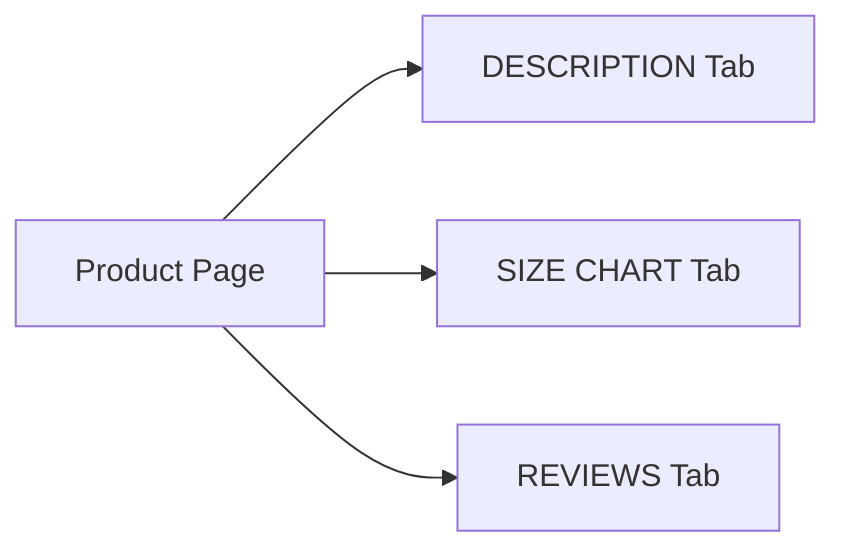

# Plan: Brand-Quality Product Pages for Rafsan Clothing

## Current State

The product page at [`app/product/[id]/page.tsx`](app/product/[id]/page.tsx:1) has:
- ✅ Product images with zoom
- ✅ Product name, SKU, price (with discount display)
- ✅ Fabric badge
- ✅ Size selector (from product.sizes array)
- ✅ Color selector (from product.colors array)
- ✅ Stock status indicator
- ✅ Quantity selector
- ✅ Add to Cart / Buy Now buttons
- ✅ Basic description section (plain text)
- ❌ No size chart / measurements
- ❌ No structured product details (Fabric & Care, Size & Fit, etc.)
- ❌ Admin panel doesn't support size_chart or structured description fields

The database in [`supabase_schema.sql`](supabase_schema.sql:48) only has `name`, `description`, `price`, `image_url`, `images`, `category`, `stock`, `sku`, `is_active`, `show_on_homepage`, `category_id`.

---

## What We Will Build

### 1. Database Schema Update
- Add `fabric` (TEXT) - fabric material
- Add `sizes` (TEXT[]) - size names like ["S","M","L","XL"]
- Add `colors` (JSONB) - `[{name, value}]` array
- Add `size_chart` (JSONB) - **per-product custom measurements** with this structure:
  ```json
  {
    "description": "Asian fit, order one size up",
    "unit": "inches",
    "headers": ["Size", "Chest", "Waist", "Length", "Shoulder"],
    "rows": [
      ["S", "36", "28", "26", "15"],
      ["M", "38", "30", "27", "16"],
      ["L", "40", "32", "28", "17"],
      ["XL", "42", "34", "29", "18"]
    ]
  }
  ```
- Add `product_details` (JSONB) - structured description with sections:
  ```json
  {
    "overview": "Premium cotton blend t-shirt...",
    "fabric_care": "Machine wash cold, tumble dry low...",
    "size_fit": "Model is 5'10\" wearing size M. Asian fit.",
    "shipping_returns": "Free shipping over ৳1000. 7-day easy returns."
  }
  ```

**Migration file**: `supabase/migrations/add_product_details.sql`

---

### 2. Update [`lib/products.ts`](lib/products.ts:3) - Product Type & CRUD
- Extend `Product` type with `size_chart`, `product_details`
- Update [`fetchProductById()`](lib/products.ts:1) to include new fields
- Update `createProduct()` and `updateProduct()` to handle new fields

---

### 3. Update [`app/admin/products/page.tsx`](app/admin/products/page.tsx:11) - Admin Panel
Add to product add/edit form:
- **Fabric** - text input
- **Sizes** - tag input (add/remove size tags)
- **Colors** - dynamic color rows (name + hex value picker)
- **Size Chart** - tabular editor:
  - Unit selector (inches/cm)
  - Description text
  - Headers row editor
  - Dynamic rows editor (add/remove rows)
  - Each row: size name + measurement columns
- **Product Details** - tabbed editor:
  - Tab 1: Overview (textarea)
  - Tab 2: Fabric & Care (textarea)
  - Tab 3: Size & Fit (textarea)
  - Tab 4: Shipping & Returns (textarea)

---

### 4. Update [`app/product/[id]/page.tsx`](app/product/[id]/page.tsx:122) - Product Page UI
Redesign the description and details section:



Changes:
- Replace single flat description with **tabbed sections**: Description, Size Chart, Reviews
- **Description tab**: Show 4 structured sections (Overview, Fabric & Care, Size & Fit, Shipping & Returns)
- **Size Chart tab**: Interactive table with headers, rows, unit label, fit notes
- **Reviews tab**: Placeholder for future review system (show "Coming Soon" for now)
- Add a **"Size Guide"** link/button near the size selector that opens the size chart modal
- Show selected size with visual highlight

---

### 5. Size Chart Modal Component
- Create `components/SizeChartModal.tsx` reusable component
- Displays the table with the product's `size_chart` data
- Shows fit notes and unit
- Mobile-responsive (horizontal scroll or collapsible)
- Triggered by "Size Guide" button on product page

---

## Execution Order

1. **Database migration** - Run SQL to add new columns
2. **Update Product type** - Extend `lib/products.ts` Product interface
3. **Update CRUD functions** - `fetchProductById`, `createProduct`, `updateProduct`
4. **Admin panel enhancements** - Add form fields for fabric, sizes, colors, size_chart, product_details
5. **SizeChartModal component** - Create reusable component
6. **Product page redesign** - Tabbed description section + size guide modal trigger

---

## Files to Modify

| File | Change |
|------|--------|
| `supabase/migrations/add_product_details.sql` | **New** - schema migration |
| `lib/products.ts` | Add fields to Product type, update fetch/create/update |
| `app/admin/products/page.tsx` | Add form inputs for all new fields |
| `components/SizeChartModal.tsx` | **New** - size chart display component |
| `app/product/[id]/page.tsx` | Tabbed description + size chart integration |