# Rafsan Clothing (therafsan.com) — COMPLETE SEO Implementation Plan

## ✅ IMPROVED & OPTIMIZED FOR BANGLADESH MARKET

---

## Current State Audit

| Area | Status | Notes |
|------|--------|-------|
| Root metadata (`layout.tsx`) | ⚠️ Minimal | Only title + generic description, no OG/Twitter/Keywords/Canonical |
| Homepage metadata | ❌ Missing | `app/page.tsx` has no `metadata` export |
| Product detail metadata | ✅ Good | Dynamic `generateMetadata` with OG + Twitter cards |
| Category pages metadata | ❌ Missing | `[slug]/page.tsx` has no metadata |
| Products listing metadata | ❌ Missing | `app/products/page.tsx` has no metadata |
| Static pages metadata | ⚠️ Basic | Title + description only, no OG |
| `robots.ts` | ❌ Missing | No robots file |
| `sitemap.ts` | ❌ Missing | No sitemap generation |
| `not-found.tsx` | ❌ Missing | No custom 404 |
| JSON-LD Structured Data | ❌ Missing | No Organization, Product, Breadcrumb, FAQ schema |
| Canonical URLs | ❌ Missing | No canonical tags anywhere |
| hreflang / locale | ❌ Missing | No Bengali locale support |
| Google Search Console | ❌ Missing | No verification meta tag |
| Image alt optimization | ⚠️ Partial | ProductCard uses product.name, but no descriptive alt strategy |
| `manifest.ts` / PWA | ❌ Missing | No web manifest |
| Blog / Content | ❌ Missing | No blog for content marketing |
| Reusable Schema Component | ❌ Missing | No `app/schema.tsx` |

---

## Target Keywords (Bangladesh Market)

### Primary Keywords
- `bd clothing`, `bd brand`, `bd fashion`, `bd tshirt`
- `bangladeshi fashion brand`, `bangladesh clothing store`
- `drop shoulder tshirt bd`, `oversized tshirt bangladesh`
- `premium tshirt bangladesh`, `export quality clothes bangladesh`
- `men clothing bd`, `women clothing bangladesh`, `kids clothing bd`
- `online clothing store dhaka`, `dhaka clothing brand`
- `rafsan clothing bangladesh`, `rafsan store bd`

### Secondary / Long-tail
- `custom apparel printing bangladesh`
- `wholesale t shirt bangladesh`, `bulk order clothing bd`
- `narayanganj fashion store`
- `bangladesh online shopping`
- `টি শার্ট বাংলাদেশ` (Bengali)
- `পোশাক অনলাইন` (Bengali)
- `ফ্যাশন ব্র্যান্ড বাংলাদেশ` (Bengali)

---

## Implementation Plan

### Phase 1: Foundation — Global SEO Infrastructure

#### 1.1 Root Layout Metadata Enhancement
**File:** [`app/layout.tsx`](app/layout.tsx:23)

Enhance the root `metadata` export with:
- `metadataBase` (canonical base URL: `https://therafsan.com`)
- `keywords` array targeting BD fashion terms (English + Bengali)
- `openGraph` with site-wide defaults + Bengali alternate locale
- `twitter` card defaults
- `robots` default policy
- `verification` for Google Search Console
- Geo tags for Bangladesh
- Mobile app capability meta tags
- Preload critical resources

```tsx
export const metadata: Metadata = {
  metadataBase: new URL(process.env.NEXT_PUBLIC_SITE_URL || "https://therafsan.com"),
  title: {
    default: "Rafsan Clothing | Premium Export Quality Fashion Bangladesh | রাফসান ক্লোথিং",
    template: "%s | Rafsan Clothing",
  },
  description: "বাংলাদেশের সেরা প্রিমিয়াম ফ্যাশন ব্র্যান্ড Rafsan Clothing। Export Quality পোশাক, ফ্রি ডেলিভারি ৳৯৯৯+। ১০০% অরিজিনাল গ্যারান্টি। WhatsApp: 01610-735064",
  keywords: [
    "bd clothing", "bangladeshi fashion", "bd brand", "bd tshirt",
    "drop shoulder tshirt bd", "oversized tshirt bangladesh",
    "men clothing bd", "women clothing bangladesh", "kids clothing bd",
    "premium tshirt bangladesh", "custom apparel bangladesh",
    "online clothing store bd", "dhaka fashion", "narayanganj clothing",
    "rafsan clothing bangladesh", "rafsan store bd",
    "export quality clothes bangladesh", "premium t shirt bd",
    "online clothing store dhaka", "fashion bangladesh",
    "custom apparel printing bangladesh", "wholesale t shirt bangladesh",
    "bulk order clothing bd", "narayanganj fashion store",
    "dhaka clothing brand", "bangladesh online shopping",
    "টি শার্ট বাংলাদেশ", "পোশাক অনলাইন", "ফ্যাশন ব্র্যান্ড বাংলাদেশ",
  ],
  authors: [{ name: "Rafsan Clothing" }],
  creator: "Rafsan Clothing",
  publisher: "Rafsan Clothing",
  formatDetection: { telephone: true, email: true, address: true },
  openGraph: {
    type: "website",
    locale: "en_US",
    alternateLocale: "bn_BD",
    siteName: "Rafsan Clothing",
    title: "Rafsan Clothing | Premium Export Quality Fashion Bangladesh",
    description: "বাংলাদেশের সেরা প্রিমিয়াম ফ্যাশন ব্র্যান্ড। Export Quality পোশাক, ফ্রি ডেলিভারি ৳৯৯৯+।",
    images: [{ url: "/og-image.png", width: 1200, height: 630, alt: "Rafsan Clothing - Premium Fashion Bangladesh" }],
  },
  twitter: {
    card: "summary_large_image",
    title: "Rafsan Clothing | Premium Fashion Bangladesh",
    description: "Export Quality পোশাক, ফ্রি ডেলিভারি ৳৯৯৯+। WhatsApp: 01610-735064",
    images: ["/og-image.png"],
  },
  robots: {
    index: true,
    follow: true,
    googleBot: { index: true, follow: true, "max-video-preview": -1, "max-image-preview": "large", "max-snippet": -1 },
  },
  verification: {
    google: process.env.GOOGLE_VERIFICATION_CODE,
  },
  alternates: { canonical: "/" },
  other: {
    "geo.region": "BD-C",
    "geo.placename": "Narayanganj",
    "geo.position": "23.6238;90.4994",
    "ICBM": "23.6238, 90.4994",
  },
};
```

**Also add to `<head>` in layout:**
```tsx
<head>
  <link rel="preconnect" href="https://fonts.googleapis.com" />
  <link rel="dns-prefetch" href="https://wa.me" />
  <link rel="preload" as="image" href="/logo.png" />
  <meta name="mobile-web-app-capable" content="yes" />
  <meta name="apple-mobile-web-app-capable" content="yes" />
  <meta name="apple-mobile-web-app-status-bar-style" content="black-translucent" />
  <meta name="theme-color" content="#0D0D0D" />
</head>
```

#### 1.2 Create `app/schema.tsx` — Reusable Schema Components
**New file:** `app/schema.tsx`

Contains three reusable components:
- **`OrganizationSchema`** — ClothingStore type with payment methods, WhatsApp, geo, opening hours
- **`ProductSchema`** — Product + Offer + ShippingDetails + free shipping threshold
- **`BreadcrumbSchema`** — Dynamic breadcrumb from items array

Full implementation with:
- Payment accepted: Cash, Credit Card, bKash, Nagad, Rocket
- WhatsApp contact point
- Bangladesh shipping details (2-5 business days)
- Free shipping threshold ৳999
- Geo coordinates for Narayanganj
- Opening hours: Sun-Thu 10am-8pm
- BDT currency throughout

#### 1.3 Create `robots.ts`
**New file:** `app/robots.ts`

```ts
import type { MetadataRoute } from "next";

export default function robots(): MetadataRoute.Robots {
  const base = process.env.NEXT_PUBLIC_SITE_URL || "https://therafsan.com";
  return {
    rules: [
      { userAgent: "*", allow: "/", disallow: ["/admin/", "/api/"] },
    ],
    sitemap: `${base}/sitemap.xml`,
  };
}
```

> **Note:** `/account/`, `/checkout/`, `/cart/` are allowed for better UX tracking.

#### 1.4 Create `sitemap.ts`
**New file:** `app/sitemap.ts`

Dynamic sitemap that fetches all products, categories, and static pages from Supabase.

Priority adjustments:
- Homepage: `1.0`
- Products listing: `0.8`
- Category pages: `0.7`
- Product pages: `0.7`
- Static pages: `0.3-0.6`

#### 1.5 Create `not-found.tsx`
**New file:** `app/not-found.tsx`

Custom 404 page with proper metadata and Bengali messaging.

#### 1.6 Create `manifest.ts`
**New file:** `app/manifest.ts`

PWA manifest with mobile-first focus:
```json
{
  "name": "Rafsan Clothing",
  "short_name": "Rafsan",
  "description": "Premium Fashion Bangladesh",
  "start_url": "/",
  "display": "standalone",
  "background_color": "#ffffff",
  "theme_color": "#0D0D0D",
  "icons": [
    { "src": "/icon-192.png", "sizes": "192x192", "type": "image/png" },
    { "src": "/icon-512.png", "sizes": "512x512", "type": "image/png" }
  ]
}
```

#### 1.7 Create `app/blog/page.tsx` — Content Marketing
**New file:** `app/blog/page.tsx`

Blog listing page for SEO content marketing with metadata targeting fashion blog keywords.

---

### Phase 2: Page-Level Metadata

#### 2.1 Homepage — `app/page.tsx`
Add `generateMetadata` + `OrganizationSchema` component:
- Title: "Rafsan Clothing | Premium Export Quality Fashion Bangladesh | রাফসান ক্লোথিং"
- Description with Bengali + free delivery mention
- JSON-LD ClothingStore schema via `<OrganizationSchema />`

#### 2.2 Products Listing — `app/products/page.tsx`
Add `generateMetadata`:
- Title: "All Products - Premium Clothing Bangladesh | Rafsan Clothing"
- Description mentioning export quality, free delivery ৳999+, COD

#### 2.3 Category Pages — `app/category/[slug]/page.tsx`
Add `generateMetadata`:
- Dynamic title: `{Category} - Shop Online Bangladesh | Rafsan Clothing`
- Description: `Buy premium {category} from Rafsan Clothing. Export quality, affordable prices, free delivery ৳999+. 100% original guarantee. Order on WhatsApp: 01610-735064`
- Add `<BreadcrumbSchema />`

#### 2.4 Static Category Pages (men, women, kids, sports)
Convert from `"use client"` to server components OR add `layout.tsx` with metadata.

#### 2.5 Static Pages (about, terms, privacy, returns, faqs)
Enhance existing metadata with:
- OpenGraph + Twitter cards
- Canonical URLs
- FAQ page: add `<FAQPageSchema />` JSON-LD

#### 2.6 Product Detail — `app/product/[id]/page.tsx`
Already has good metadata. Enhance with:
- `<ProductSchema product={product} />` — full Product + Offer + ShippingDetails
- `<BreadcrumbSchema />` — dynamic breadcrumb
- Review/aggregate rating schema (if reviews exist in DB)
- `alternates.canonical`

---

### Phase 3: JSON-LD Structured Data (via `app/schema.tsx`)

#### 3.1 ClothingStore Schema (Homepage + Footer)
```json
{
  "@context": "https://schema.org",
  "@type": "ClothingStore",
  "name": "Rafsan Clothing",
  "url": "https://therafsan.com",
  "logo": "https://therafsan.com/logo.png",
  "image": "https://therafsan.com/og-image.png",
  "description": "বাংলাদেশের প্রিমিয়াম ফ্যাশন ব্র্যান্ড Rafsan Clothing",
  "telephone": "+8801610735064",
  "email": "rafsanclothing@gmail.com",
  "priceRange": "৳৳",
  "currenciesAccepted": "BDT",
  "paymentAccepted": ["Cash", "Credit Card", "bKash", "Nagad", "Rocket"],
  "address": {
    "@type": "PostalAddress",
    "addressLocality": "Narayanganj",
    "addressRegion": "Dhaka Division",
    "addressCountry": "BD"
  },
  "geo": {
    "@type": "GeoCoordinates",
    "latitude": "23.6238",
    "longitude": "90.4994"
  },
  "openingHoursSpecification": [{
    "@type": "OpeningHoursSpecification",
    "dayOfWeek": ["Sunday", "Monday", "Tuesday", "Wednesday", "Thursday"],
    "opens": "10:00",
    "closes": "20:00"
  }],
  "contactPoint": [
    {
      "@type": "ContactPoint",
      "telephone": "+8801610735064",
      "contactType": "customer service",
      "availableLanguage": ["English", "Bengali"],
      "areaServed": "BD"
    },
    {
      "@type": "ContactPoint",
      "telephone": "+8801610735064",
      "contactType": "sales",
      "availableLanguage": ["English", "Bengali"],
      "url": "https://wa.me/8801610735064"
    }
  ],
  "sameAs": [
    "https://www.facebook.com/rafsanstorefb",
    "https://www.instagram.com/rafsanstoreig",
    "https://youtube.com/@rafsanclothing",
    "https://tiktok.com/@rafsanclothing"
  ]
}
```

#### 3.2 WebSite + SearchAction Schema (Layout)
```json
{
  "@context": "https://schema.org",
  "@type": "WebSite",
  "name": "Rafsan Clothing",
  "url": "https://therafsan.com",
  "potentialAction": {
    "@type": "SearchAction",
    "target": "https://therafsan.com/products?search={search_term_string}",
    "query-input": "required name=search_term_string"
  }
}
```

#### 3.3 Product Schema (Product Detail Page)
```json
{
  "@context": "https://schema.org",
  "@type": "Product",
  "name": "Product Name",
  "description": "Product description...",
  "image": ["image-urls"],
  "sku": "product-id",
  "brand": { "@type": "Brand", "name": "Rafsan Clothing" },
  "offers": {
    "@type": "Offer",
    "price": "599",
    "priceCurrency": "BDT",
    "availability": "https://schema.org/InStock",
    "url": "https://therafsan.com/product/id",
    "priceValidUntil": "2026-06-14",
    "seller": { "@type": "Organization", "name": "Rafsan Clothing" },
    "shippingDetails": {
      "@type": "OfferShippingDetails",
      "shippingRate": { "@type": "MonetaryAmount", "value": "60", "currency": "BDT" },
      "shippingDestination": { "@type": "DefinedRegion", "addressCountry": "BD" },
      "deliveryTime": {
        "@type": "ShippingDeliveryTime",
        "businessDays": { "@type": "QuantitativeValue", "minValue": 2, "maxValue": 5 }
      }
    }
  }
}
```

#### 3.4 BreadcrumbList Schema (Product & Category Pages)
#### 3.5 FAQPage Schema (FAQs Page)
#### 3.6 AggregateOffer + Free Shipping Threshold (Products listing)
```json
{
  "@type": "AggregateOffer",
  "lowPrice": "500",
  "highPrice": "3000",
  "priceCurrency": "BDT",
  "offerCount": "150",
  "availability": "https://schema.org/InStock",
  "shippingDetails": {
    "@type": "OfferShippingDetails",
    "freeShippingThreshold": { "@type": "MonetaryAmount", "value": "999", "currency": "BDT" }
  }
}
```

---

### Phase 4: Technical SEO

#### 4.1 Canonical URLs
Add `alternates.canonical` to every page's metadata.

#### 4.2 Image Alt Text Strategy (IMPROVED)
Format: `"Premium {Product Name} - {Color} {Material} - Export Quality | Rafsan Clothing Bangladesh"`

Examples:
- `"Premium White Cotton T-Shirt - 100% Cotton - Export Quality | Rafsan Clothing Bangladesh"`
- `"Men's Black Polo Shirt - Pique Fabric - Premium Quality | Rafsan Clothing Bangladesh"`

#### 4.3 Performance
- Already using ISR (`revalidate = 60`) — good
- Already using `optimizePackageImports` — good
- Add `sharp` for production image optimization
- Preload critical resources (logo, fonts)
- DNS prefetch for WhatsApp

#### 4.4 Mobile Optimization (CRITICAL — 90% BD users on mobile)
- `mobile-web-app-capable` meta tag
- `apple-mobile-web-app-capable` meta tag
- `theme-color` meta tag
- PWA manifest with standalone display
- Optimize for slow 3G/4G networks

---

### Phase 5: Local SEO (Bangladesh Market)

#### 5.1 Bengali Language Support
- `alternateLocale: "bn_BD"` in OpenGraph
- Bengali keywords in metadata
- Bengali description meta tag: `<meta name="description" lang="bn" content="বাংলাদেশের প্রিমিয়াম ফ্যাশন ব্র্যান্ড..." />`
- `lang="en"` with hreflang alternates

#### 5.2 Local Business Signals
- Address in footer (already present: Narayanganj, Dhaka Division)
- Phone number (already present)
- Geo coordinates in schema
- Opening hours in schema
- Google My Business alignment

#### 5.3 Bangladesh-Specific Elements
- BDT (৳) currency everywhere
- bKash/Nagad/Rocket payment schema
- WhatsApp Business integration
- Cash on Delivery emphasis
- Free delivery threshold (৳999+)

---

### Phase 6: Analytics & Tracking

#### 6.1 Enhanced E-commerce Events (GA4)
- `add_to_cart` event with BDT currency
- `view_item` event
- `purchase` event with transaction ID

#### 6.2 WhatsApp Click Tracking
Track WhatsApp button clicks for engagement analytics.

---

### Phase 7: Admin Panel SEO Controls (Future Enhancement)

Add fields to the admin product/category editor:
- Custom meta title (override auto-generated)
- Custom meta description
- Custom OG image
- `noindex` toggle per product/category

---

## File Change Summary

| File | Action | Description |
|------|--------|-------------|
| `app/layout.tsx` | **Modify** | Enhanced root metadata + geo tags + preload + mobile meta |
| `app/schema.tsx` | **Create** | Reusable JSON-LD components (Organization, Product, Breadcrumb) |
| `app/robots.ts` | **Create** | Dynamic robots.txt (allow /account/, /checkout/, /cart/) |
| `app/sitemap.ts` | **Create** | Dynamic XML sitemap with products, categories, static pages |
| `app/not-found.tsx` | **Create** | Custom 404 with metadata + Bengali messaging |
| `app/manifest.ts` | **Create** | PWA web manifest (mobile-first) |
| `app/blog/page.tsx` | **Create** | Blog listing for content marketing |
| `app/page.tsx` | **Modify** | Add metadata + OrganizationSchema |
| `app/products/page.tsx` | **Modify** | Add generateMetadata |
| `app/category/[slug]/page.tsx` | **Modify** | Add generateMetadata + BreadcrumbSchema |
| `app/category/men/page.tsx` | **Modify** | Convert to server component or add layout metadata |
| `app/category/women/page.tsx` | **Modify** | Convert to server component or add layout metadata |
| `app/category/kids/page.tsx` | **Modify** | Convert to server component or add layout metadata |
| `app/category/sports/page.tsx` | **Modify** | Convert to server component or add layout metadata |
| `app/product/[id]/page.tsx` | **Modify** | Add ProductSchema + BreadcrumbSchema |
| `app/about/page.tsx` | **Modify** | Enhance metadata with OG + Twitter |
| `app/terms/page.tsx` | **Modify** | Enhance metadata with OG + Twitter |
| `app/privacy/page.tsx` | **Modify** | Enhance metadata with OG + Twitter |
| `app/returns/page.tsx` | **Modify** | Enhance metadata with OG + Twitter |
| `app/faqs/page.tsx` | **Modify** | Add metadata + FAQPage schema |
| `components/ProductCard.tsx` | **Modify** | Enhanced alt text with brand + material + category |
| `components/SiteFooter.tsx` | **Modify** | Add ClothingStore schema markup |
| `public/og-image.png` | **Create** | 1200×630px OG image |
| `.env.local` | **Modify** | Add `NEXT_PUBLIC_SITE_URL`, `GOOGLE_VERIFICATION_CODE` |

---

## Mermaid: SEO Architecture Overview

```mermaid
flowchart TB
    subgraph Foundation["Foundation Layer"]
        LAYOUT["app/layout.tsx\nRoot Metadata + Geo Tags + Mobile Meta"]
        SCHEMA["app/schema.tsx\nReusable JSON-LD Components"]
        ROBOTS["app/robots.ts\nCrawl Rules"]
        SITEMAP["app/sitemap.ts\nDynamic URL Index"]
        MANIFEST["app/manifest.ts\nPWA Manifest"]
        NOTFOUND["app/not-found.tsx\nCustom 404"]
        BLOG["app/blog/page.tsx\nContent Marketing"]
    end

    subgraph Pages["Page-Level SEO"]
        HOME["app/page.tsx\nClothingStore Schema"]
        PRODUCTS["app/products/page.tsx\nCollection + AggregateOffer"]
        CATEGORY["app/category/[slug]\nCategory + Breadcrumb"]
        PRODUCT["app/product/[id]\nProduct + Offer + Shipping"]
        STATIC["Static Pages\nAbout, Terms, FAQ etc."]
    end

    subgraph Structured["Structured Data"]
        ORG["ClothingStore\n+ bKash/Nagad/Rocket\n+ WhatsApp\n+ Geo + Hours"]
        WEB["WebSite + SearchAction"]
        PROD["Product + Offer\n+ ShippingDetails\n+ FreeShippingThreshold"]
        BREAD["BreadcrumbList"]
        FAQ["FAQPage"]
    end

    subgraph Signals["Bangladesh SEO Signals"]
        CANONICAL["Canonical URLs"]
        OG["OpenGraph + Bengali Locale"]
        TWITTER["Twitter Cards"]
        ALT["Image Alt: Premium + Material"]
        GEO["Geo Tags: BD-C"]
        BDT["BDT Currency Everywhere"]
        MOBILE["Mobile-First Meta"]
    end

    SCHEMA --> ORG
    SCHEMA --> PROD
    SCHEMA --> BREAD
    HOME --> ORG
    PRODUCT --> PROD
    PRODUCT --> BREAD
    CATEGORY --> BREAD
    STATIC --> FAQ
    SITEMAP --> CANONICAL

    Foundation --> Pages
    Pages --> Structured
    Pages --> Signals
```



---

## Post-Implementation Checklist

- [ ] Google Search Console connected
- [ ] Sitemap submitted to GSC
- [ ] robots.txt accessible at `therafsan.com/robots.txt`
- [ ] Sitemap accessible at `therafsan.com/sitemap.xml`
- [ ] All schema validates at schema.org validator
- [ ] OG image displays correctly on Facebook
- [ ] Twitter cards display correctly
- [ ] Mobile site loads in <3 seconds
- [ ] WhatsApp button tracked in Analytics
- [ ] All images have descriptive alt text
- [ ] Bengali keywords rendering correctly
- [ ] BDT currency showing everywhere
- [ ] Free delivery threshold (৳999+) mentioned in schema
- [ ] Social media URLs verified and correct

---

## Environment Variables Required

```env
NEXT_PUBLIC_SITE_URL=https://therafsan.com
GOOGLE_VERIFICATION_CODE=your-google-verification-code